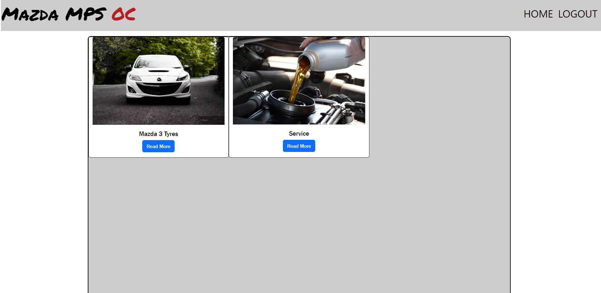

# MPSOC Forum

[View deployed site here](https://mpsblog.herokuapp.com/)

MPSOC Forum, is an online forum for Mazda MPS Owners to find out information and discuss personal owner stories. This site is for registered users only, which will then give the user access to the chat threads to engage with fellow owners to provide useful and helpful information to each other. Admin are regularly involved in introducing new chat threads to meet the needs of all users and the topics they wish to discuss.

## User Stories

1. As an admin user I want to be able to create new posts
2. As an admin user I want to be able to filter posts by car and date created to keep the content fresh
3. As an admin user I want to be able to delete old posts and comments
4. As a site user I want to be able to view different information topics
5. As a site user I want to be able to add comments and read other peoples comments

## Agile Tools

I have used the Github projects kanban style board within this project to really identify and structure each process within the app build, this allowed me to establish a control
mechanism that assessed app completion progress and also future improvements to work on to bring the project on to the next level. It is important to use tools such as this, especially within real life industry when there is more than one person working on the same project so that people are all working on different parts of the development to piece together for the finished goal of a tried and tested successful application.

## Project Planning

### Key Project Ideas

- Grey / White Colour Scheme - to create a professional look to the site with good contrast
- Simplistic Design - to draw attention to the site content and provide easy navigation and accessibility
- Bootstrap Cards and Grid layout for blog posts - to provide structure to content within the home page, with relatable imagery and the post title so that the user can choose which discussion they wish to get involved with.
- Main content div central to page with margins either side

### Project Design Mockups

- I used pen and paper to map out the design of my websites, i used this to plan the overall structure of how the site will look, I had an idea on my desired colour schemes which is evident in the designs, however i knew that i would be able to adjust this as i saw fit throughout the progression of the site. Personally, within project development i struggle to fully plan colour schemes and aesthetically pleasing components at the initial outset, i feel alot more comfortable with the development and would, in a perfect world, like to work from a plan already drawn out for me. However, for the purposes of this project and the course criteria, this is the general plan i came up with before diving into the coding!

- [Home page](static/img/home_page.jpg)
- [Blog Post Page](static/img/open_post.jpg)
- [Account Control Page](static/img/account_page.jpg)

## Features

- Non-Authenticated Users will have preview of the subject threads and related images, however will be advised to create an account.
- Authenticated Users will be able to navigate through the site and read more regarding the desired information topic
- Authenticated Users will also be able to add comments into the subject so they can communicate with other users

## Future Features

- Authenticated Users will be able to complete a thread creation form, which will add to the threads
- Authenticated Users will be able to manage their own posts, whether that be edit or delete

## Technologies Used 

- HTML5
- CSS
- Python
- Postgres
- Cloudinary for static and media files
- Bootstrap
- Django

## Testing

- Chrome DevTools
- PEP8 - Python code Validator - No errors
- W3C CSS Validator - No errors
- Manual Testing completed while creating the project.

### Home page Testing 

- Nav Links Functional - All Nav links working from each page, nav links display also change upon the condition of the user being a registered account holder or not.
- Sign up - Sign up form allows users to input user name and password to create their account
- Log in - Incorrect details deny login correctly, correct details gain access to the account priviledges
- Responsive - All aspects of the site and pages are responsive and adjust fittingly too each device size
- Thread cards - Encourage user to create an account to see the content, doesnt allow the user to proceed to the discussion url
- Pagination - Works correctly upon the creation of more than 6 thread cards

### Authenticated User Testing

- Card read more button - Load open_post html with more detail around topic discussion
- Nav bar update - Nav bar available links changed and all working correctly
- Comment - Users can add comments to the discussion card, which details time and date of comment and user name. UX designed to target a chat feel with different coloured bubbles.

## Deployment
## My project deployment

- This project is deployed via Heroku
- My project was created in Gitpod
- Git was used for Version Control
- My project was deployed once I had completed the majority of manual testing.

### Deploying Via Heroku

Create an env.py file, you will need the following variables for your project - 
- SECRET_KEY: (randomly generated)
- CLOUDINARY_URL: Copy your CLOUDINARY_URL from the dashboard
- DATABASE_URL: This is the value of DATABASE_URL in Heroku
- Make sure in settings.py to set the ALLOWED_HOSTS value to use your localhost and Heroku app name.

### Deploying to Heroku

To deploy to Heroku follow these steps: 

1. Locate the New button at the top right end side of the dashboard. 
2. Click on Create new app, select your region and pick a suitable name for your project.  
3. In Settings add buildpack Python.
4. Add Database to App Resources. Go into the Resources Tab then Add-ons then search and add Heroku Postgres. 
5. In the Settings Tab, in Config Vars, make sure you have the DATABASE_URL added with the previous step and to add the other variables: SECRET_KEY and CLOUDINARY_URL. Ensure the variables here are then matched up with the env.py 
6. Select Deploy from the navigation bar
7. Select the deployment method of Github and seach for your repository. 
8. Proceed to link the Heroku app to the repository by clicking on connect. 
9. Click on Deploy.

### Forking a Repository

- Forking is a good utility to use to make a copy of an original repository so that this can be edited without making any changes to the original development repository.

- Locate a repository you wish to copy

- The Fork button is above the repository control bar to the right.

- Once clicked this will then create the repository copy to your Github account.

### Cloning a Repository

- You can clone a repository straight to Gitpod if needed.

- Locate a repository you wish to clone

- Just below the repository control bar, there is a green Gitpod button.

- This will then open the project in Gitpod for you (if gitpod is installed).